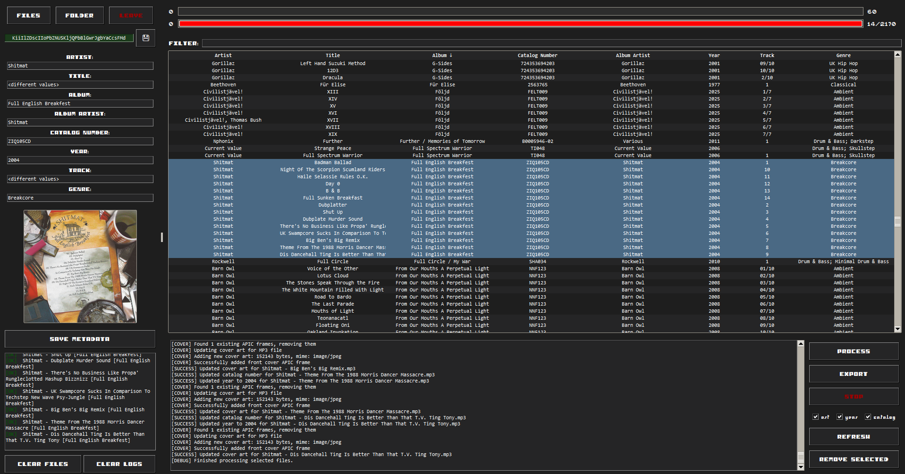
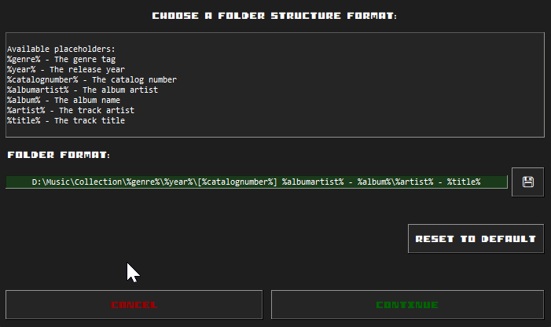

# Phonodex - Music Metadata Manager (with Automatic Metadata Fetching)



Currently compatible with **Windows only** (due to clipboard operations).

A desktop application for managing and organizing music file metadata.
By having correct Artist and Title and/or Album, it can automatically fetch the Cover Art, Catalog Number and Year.
While all metadata is retrieved from Discogs, we only apply these as we assume others are filled in already.
Genre is usually user-customized, for example, so we don't apply it.
It uses the Discogs API (max. 60 calls/minute) to fetch this information.

You can get a Discogs API key by doing the following:
- Log in to [Discogs](https://www.discogs.com/),
- Go to [Settings -> Developer](https://www.discogs.com/settings/developers),
- Click Generate New Token.

## Backstory

I identified the need for an automatic way to fill in certain metadata fields. I used to do all tagging manually using Discogs, so I decided to create a MP3Tag extension to do that for me.
After that was developed, I decided to turn it into an actual application with a GUI that's familiar and easy to use.
All functionality was achieved in around 10 days, and I've recently been working to turn the main.py monolith into separate modules.

**For some context**: I'm ***not*** a developer, I have no coding background except VERY basic Python usage before college, and C in college.
However, I'm naturally curious and have fun with logic and troubleshooting, so I decided to try this 'small' project using different **AI tools**.
This will explain why, for a programmer, the code will definitely have things that could be optimized or might not look logical at first. Hence, I decided to create this project on GitHub.

## Features

- 🎵 Batch edit ID3 tags and metadata for multiple audio formats (MP3, FLAC, M4A, OGG, WMA, WAV)
- 🔍 Automatic metadata fetching from Discogs API (for Album Art, Catalog Number, Year)
- 🚦 Automatic API request limiter (max 60 requests/minute)
- 🖼️ Clipboard support for Album Art
- 📁 Exporting files from the imported folders to the final Music Collection folder
- 🔄 Drag-and-drop file support
- 📊 Visual progress tracking for both file processing and API usage

## Supported Audio Formats
- MP3 (ID3 tags)
- FLAC
- M4A/MP4
- OGG Vorbis
- WMA (Windows Media Audio)
- WAV

## Dependencies

- tkinter / tkinterdnd2 - UI framework with drag-and-drop support
- mutagen - Audio metadata handling
- requests - API communication


## Installation

1. Clone the repository
2. Optional: Setup a virtual environment so dependencies are not installed globally:

```bash
python3 -m venv venv
source venv/bin/activate
```

3. Install dependencies

```bash
pip install -r requirements.txt
```

4. Run the application:

```bash
python3 main.py
```

## File Exporting

The application stores the destination folder for exporting in `folder_format_settings.json`. The default structure format (that I use) is:

```
D:\Music\Collection\%genre%\%year%\[%catalognumber%] %albumartist% - %album%\%artist% - %title%
```



You can customize this format using the following placeholders:
- %genre%
- %year%
- %catalognumber%
- %albumartist%
- %album%
- %artist%
- %title%

## Usage

1. Launch the application
2. Add your Discogs API token in the top input field, and click SAVE


3. Load files either by:
   - Clicking the "FILES" button to select individual files
   - Clicking the "FOLDER" button to select a folder
   - Dragging and dropping files into the application
4. Select the files you want to process (CTRL+A selects all files loaded)
5a. Click on the checkboxes for 'art', 'year' and/or 'catalog'. Then, click "PROCESS" to fetch metadata from Discogs automatically
5b. Edit metadata directly by double-clicking the field on the table **(click the Enter key to save)**, or for selected files on the left pane **(click SAVE METADATA)**
6. Use "EXPORT" to organize files into your collection

## Contributing

Contributions are welcome!
Please feel free to submit a Pull Request.

## License

MIT
